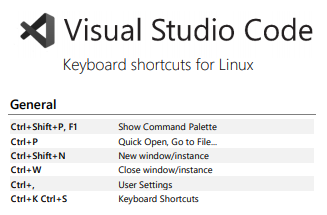

<h1 align="center">
:small_red_triangle_down: Backend do Projeto Salas de Reunião
</h1>

<h4 align="center">
API em Java com Spring Boot para o app rooms-meeting
</h4>

<h2 align="center">
Bootcamp everis Fullstack Developer pela Digital Innovation One
</h2>

  

  

O objetivo deste projeto é desenvolver uma API em Java com Spring Boot para ser consumida pelo App Salas de Reunião (rooms-meeting).

  <a href="#gem-conteudo-do-curso">Conteúdo do Curso</a>&nbsp;&nbsp;&nbsp;|&nbsp;&nbsp;&nbsp;
  <a href="#rocket-tecnologias">Tecnologias</a>&nbsp;&nbsp;&nbsp;|&nbsp;&nbsp;&nbsp;
  <a href="#books-aprendizado">Aprendizado</a>&nbsp;&nbsp;&nbsp;|&nbsp;&nbsp;&nbsp;
  <a href="#computer-instalação">Instalação</a>&nbsp;&nbsp;&nbsp;|&nbsp;&nbsp;&nbsp;
  <a href="#small_orange_diamond-compartilhando">Compartilhando</a>&nbsp;&nbsp;&nbsp;|&nbsp;&nbsp;&nbsp;
  <a href="#small_orange_diamond-licença">Licença</a>&nbsp;&nbsp;&nbsp;|&nbsp;&nbsp;&nbsp;
  <a href="#small_orange_diamond-agradecimentos">Agradecimentos</a>

## :gem: Conteúdo do Curso
 1. Setup inicial de projeto com o Spring Boot Initialzr (start.spring.io).
 2. Criando as operações de gerenciamento de salas do sistema (Cadastro, Consulta, Alteração e Remoção de salas).
 3. Teste de consumo da API com o Postman.

## :rocket: Tecnologias
Estas foram as tecnologias utilizadas neste projeto:
 * Spring Web
 * Spring Data JPA
 * H2 Database
 * Java
 * Maven
 
## :books: Aprendizado
 - Incluindo as dependências Spring Web, Spring Data, H2 e Lombok.
 - Usando H2 para simular banco de dados em memória.
 - Entendendo o Cross Origin para permitir que o Frontend consuma a API.
 
## :computer: Instalação
1. Clone este repositório no seu computador (FORA da pasta do frontend):

    `$ git clone https://github.com/clovisdanielcosta/api-rooms-meeting.git`

2. Digite num terminal:

    `$ cd api-rooms-meeting`

3. Para executar o projeto no terminal, digite o seguinte comando:

    `$ mvn spring-boot:run`

4. Após executar o comando acima, basta apenas abrir o seguinte endereço e visualizar a execução do projeto:

`http://localhost:8080/api/v1/rooms`

Link para o repositório Salas de Reunião (rooms-meting):
[App Salas de Reunião](https://github.com/clovisdanielcosta/rooms-meeting.git)

### Endpoints criados na API
* Criar sala de reuniao
POST - /api/v1/rooms
* Listar todas as salas
GET - /api/v1/rooms
* Buscar uma sala pelo Id
GET - /api/v1/rooms/{id}
* Atualizar uma sala pelo Id
PUT - /api/v1/rooms/{id}
* Excluir uma sala pelo id
DELETE - /api/v1/rooms/{Id}

## :small_orange_diamond: Compartilhando 
Atalhos para o IntelliJ (Reference Card).

[IntelliJ Reference Card](./docs/IntelliJIDEA_ReferenceCard.pdf) (pdf completo)

  

Atalhos de teclados para o VSCode.

[Windows](./docs/keyboard-shortcuts-windows.pdf) (pdf completo)

  

[Linux](./docs/keyboard-shortcuts-linux.pdf) (pdf completo)

  

[macOS](./docs/keyboard-shortcuts-linux.pdf) (pdf completo)

  

## :small_orange_diamond: Licença

Esse projeto está sob a licença MIT. Veja o arquivo [LICENSE](LICENSE.md) para mais detalhes.
A(s) imagem(s) usada(s) neste projeto são originais do autor ou foram obtidas através de sites de terceiros com a devida autorização para uso gratuito.

## :small_orange_diamond: Agradecimentos

Quero agradecer a <b>Digital Innovation One</b> e <b>everis</b> e parabenizar a especialista Kamila Santos pelo modo claro, tranquilo e excelente ao ensinar durante as aulas. Parabéns, vocês estão fazendo um ótimo trabalho em favor da comunidade! 

Muito obrigado! :clap::clap:
